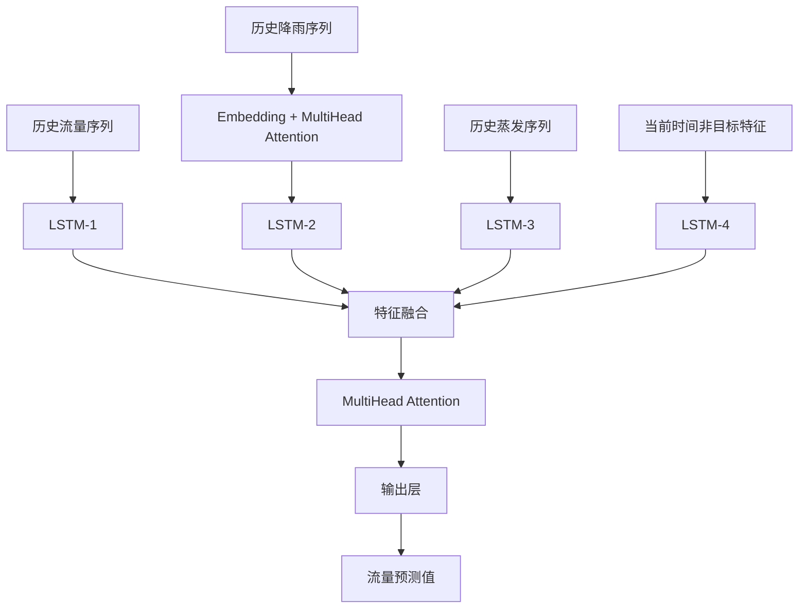

# StreamPredict - 基于LSTM多头注意力的流量预测系统


一个基于深度学习的河道流量预测系统，采用LSTM和多头注意力机制实现高精度的流量滚动预报。

## 🌟 核心特性

- **多特征融合**: 融合历史流量、降雨、蒸发等多种水文要素
- **注意力机制**: 采用多头注意力捕获不同站点和时间的关键信息
- **滚动预报**: 支持逐步滚动预测，实时更新预报结果
- **完整工程化**: 从数据处理到模型部署的完整流程
- **高精度预测**: 基于深度学习的自回归模型

## 📊 模型架构

### StreamModel 核心组件



**模型特点**:
- **四个LSTM编码器**: 分别处理流量、降雨、蒸发和辅助特征
- **双注意力机制**: 捕获降雨站点间关系和全局特征依赖
- **自回归预测**: 支持多步滚动预报

**输入格式**:
- 历史流量序列: `[batch_size, 24, 3]` - 24个时间步的3个流量站点
- 历史降雨序列: `[batch_size, 24, 23]` - 24个时间步的23个雨量站
- 历史蒸发序列: `[batch_size, 24, 1]` - 24个时间步的蒸发数据
- 当前特征: `[batch_size, 26]` - 当前时间步的非目标特征

## 🗂️ 项目结构

```
StreamPredict/
├── src/                          # 核心源代码模块
│   ├── DataProcess.py           # 数据处理和PyTorch数据集
│   ├── Model.py                 # StreamModel深度学习模型
│   ├── trainers.py              # 模型训练器和评估器
│   ├── load_model.py            # 模型加载和预测模块
│   └── __init__.py              # 包初始化文件
├── utils/                        # 数据处理工具模块
│   ├── check_time_continuous.py # 时间序列连续性检查
│   ├── merge_all_csv_data.py    # 多源数据合并工具
│   ├── read_features_predict.py # 预测特征数据读取
│   └── split_hourly_to_5min.py  # 小时数据转5分钟工具
├── data/                         # 数据存储目录
│   ├── merged_all_data.csv      # 合并后的训练数据
│   ├── data_p/                  # 原始小时降雨数据
│   ├── data_p_5min/            # 转换后的5分钟降雨数据
│   ├── pre_data/               # 预测用数据目录
│   └── [其他数据文件...]         # 流量和蒸发等原始数据
├── model_file/                   # 模型文件存储
│   └── best_model.pth          # 训练好的最佳模型
├── standard_scalar/             # 数据标准化器存储
│   ├── standard_stream_scaler.pkl    # 流量数据标准化器
│   ├── standard_rainfall_scaler.pkl  # 降雨数据标准化器
│   ├── standard_evap_scaler.pkl      # 蒸发数据标准化器
│   └── standard_current_features_scaler.pkl # 特征标准化器
├── fig/                         # 图像输出目录
│   └── pre_result.png          # 预测结果图像
├── config.py                    # 全局配置文件
├── model_train.py               # 模型训练主脚本
├── predict.py                   # 流量预测主脚本
├── requirements.txt             # 项目依赖包列表
└── README.md                    # 项目说明文档
```

## 🚀 快速开始

### 环境要求

```bash
python >= 3.7
torch >= 1.8.0
pandas >= 1.2.0
numpy >= 1.19.0
scikit-learn >= 0.24.0
matplotlib >= 3.3.0
joblib >= 1.0.0
tqdm >= 4.60.0
```

### 安装依赖

```bash
pip install -r requirements.txt
```

### 数据准备

1. **原始数据处理**:
```bash
# 将小时降雨数据转换为5分钟数据
python utils/split_hourly_to_5min.py

# 合并所有数据源
python utils/merge_all_csv_data.py
```

2. **数据格式要求**:
   - 时间间隔: 5分钟
   - 特征列: 包含流量、降雨、蒸发等水文要素
   - 时间格式: `YYYY-MM-DD HH:MM:SS`
   - 训练数据: `data/merged_all_data.csv`
   - 预测数据: `data/pre_data/features.csv`

### 模型训练

```bash
# 使用默认配置训练
python model_train.py
```

训练过程会自动:
- 读取 `data/merged_all_data.csv` 训练数据
- 创建数据标准化器并保存到 `standard_scalar/`
- 保存最佳模型到 `model_file/best_model.pth`
- 生成训练历史图表到 `fig/` 目录

### 流量预测

```bash
# 执行滚动预报
python predict.py
```

预测过程会:
- 加载训练好的模型 `model_file/best_model.pth`
- 读取预测数据 `data/pre_data/features.csv`
- 生成滚动预测结果并保存到 `data/pre_data/result.csv`
- 显示预测结果图表

## ⚙️ 配置参数

### 模型参数 (config.py)

| 参数 | 默认值 | 说明 |
|------|--------|------|
| `sequence_length` | 24 | 历史数据序列长度(时间步) |
| `num_stream_features` | 3 | 流量特征数量 |
| `num_rainfall_features` | 23 | 降雨站点数量 |
| `num_evap_features` | 1 | 蒸发特征数量 |
| `hidden_size` | 128 | LSTM隐藏层维度 |
| `num_layers` | 2 | LSTM层数 |
| `dropout` | 0.1 | Dropout比例 |
| `embed_dim` | 128 | 注意力嵌入维度 |
| `m` | 16 | 注意力头数计算倍数 |

### 训练参数

| 参数 | 默认值 | 说明 |
|------|--------|------|
| `batch_size` | 32 | 批次大小 |
| `num_epochs` | 100 | 最大训练轮数 |
| `learning_rate` | 0.001 | 学习率 |
| `test_size` | 0.2 | 测试集比例 |
| `val_size` | 0.1 | 验证集比例 |
| `random_state` | 42 | 随机种子 |

### 文件路径配置

| 配置项 | 路径 | 说明 |
|-------|------|------|
| `data_file` | `data/merged_all_data.csv` | 训练数据文件 |
| `data_predict_file` | `data/pre_data` | 预测数据目录 |
| `standard_scalar_file` | `standard_scalar` | 标准化器存储目录 |
| `model_save_file` | `model_file/best_model.pth` | 模型保存路径 |
| `fig_save_file` | `fig` | 图像保存目录 |

## 📈 训练监控

训练过程包含以下监控指标:

- **损失函数**: RMSE (均方根误差)
- **早停机制**: 防止过拟合 (patience=50)
- **学习率调度**: ReduceLROnPlateau自适应调整
- **梯度裁剪**: 防止梯度爆炸 (max_norm=1.0)
- **权重衰减**: L2正则化 (weight_decay=1e-5)

训练完成后自动生成:
- `fig/training_history.png`: 训练和验证损失曲线
- `fig/predictions.png`: 预测结果对比图
- `model_file/best_model.pth`: 最佳模型权重文件

## 📊 评估指标

| 指标 | 说明 | 用途 |
|------|------|------|
| **MSE** | 均方误差 | 基础误差度量 |
| **RMSE** | 均方根误差 | 主要优化目标 |
| **MAE** | 平均绝对误差 | 鲁棒性评估 |
| **R²** | 决定系数 | 模型解释能力 |
| **MAPE** | 平均绝对百分比误差 | 相对误差评估 |

## 🔄 滚动预报

系统支持实时滚动预报:

1. **数据输入**: 读取 `data/pre_data/features.csv`
2. **序列构建**: 提取最近24个时间步的历史数据
3. **模型预测**: 使用训练好的模型预测下一时间步流量
4. **结果更新**: 将预测值作为下一轮的输入特征
5. **质量检查**: 自动验证时间连续性和数据完整性
6. **结果保存**: 输出到 `data/pre_data/result.csv`

### 预测流程监控
- 实时显示预测进度
- 自动检测数据异常并处理
- 支持中断恢复和错误处理

## 💡 技术亮点

### 1. 多尺度特征融合
- **时间维度**: 24步历史序列 (2小时历史信息)
- **空间维度**: 23个降雨站点的空间分布
- **要素维度**: 流量、降雨、蒸发等水文要素
- **站点维度**: 官厅、斋堂、雁翅3个流量监测站

### 2. 双注意力机制
- **降雨注意力**: 识别关键降雨站点对目标流量的影响权重
- **全局注意力**: 捕获所有时空特征间的复杂非线性关系

### 3. 工程化设计
- **数据流水线**: 自动化数据预处理和特征工程
- **模型管理**: 完整的训练、验证、测试流程
- **结果可视化**: 自动生成训练曲线和预测对比图
- **异常处理**: 数据质量检查和错误恢复机制

## 🛠️ 数据处理工具

### 时间序列处理
```bash
# 小时数据转5分钟数据
python utils/split_hourly_to_5min.py
```
- 输入: `data/data_p/` 小时降雨数据
- 输出: `data/data_p_5min/` 5分钟降雨数据
- 方法: 线性插值处理时间间隔≤2小时的数据

### 数据合并
```bash
# 合并多源数据
python utils/merge_all_csv_data.py
```
- 合并: 流量、降雨、蒸发等多种数据源
- 输出: `data/merged_all_data.csv` 统一训练数据
- 策略: 内连接保证时间对齐

### 数据质量检查
```python
from utils.check_time_continuous import check_time_continuous

# 检查时间序列连续性
is_continuous = check_time_continuous('data.csv')
```

### 预测特征读取
```python
from utils.read_features_predict import creat_temp_data

# 创建预测用临时数据
creat_temp_data(features_data_file, lines, sequence_length, predict_result, temp_file)
```

## 📝 使用案例

### 完整训练流程
```python
from src.trainers import StreamModelTrainer
import config

# 1. 创建训练器
trainer = StreamModelTrainer(
    data_file=config.data_file,
    standard_scalar_file=config.standard_scalar_file
)

# 2. 准备数据
train_loader, val_loader, test_loader = trainer.prepare_data(
    batch_size=config.batch_size
)

# 3. 训练模型
history = trainer.train(
    train_loader=train_loader,
    val_loader=val_loader,
    num_epochs=config.num_epochs,
    learning_rate=config.learning_rate
)

# 4. 评估模型
metrics = trainer.evaluate(test_loader)
print(f"RMSE: {metrics['RMSE']:.4f}")
print(f"R²: {metrics['R2']:.4f}")

# 5. 可视化结果
trainer.plot_training_history()
trainer.plot_predictions(metrics)
```

### 执行预测
```python
from src.load_model import StreamPredict

# 加载训练好的模型
predictor = StreamPredict(
    model_path=config.model_save_file,
    data_file=config.data_predict_file + '/features.csv',
    standard_scalar=config.standard_scalar_file
)

# 加载模型并执行预测
predictor.load_model()
predictions= predictor.predict()

# 可视化预测结果
predictor.plot_predictions(predictions)
```

### 自定义配置
```python
# 修改模型参数
custom_config = {
    'sequence_length': 48,  # 使用4小时历史数据
    'hidden_size': 256,     # 增大模型容量
    'num_layers': 3,        # 添加更多LSTM层
    'dropout': 0.2          # 增强正则化
}

trainer = StreamModelTrainer(
    data_file=config.data_file,
    standard_scalar_file=config.standard_scalar_file,
    model_config=custom_config
)
```

## 🔧 故障排除

### 常见问题

1. **数据时间不连续**
   - 症状: 训练数据量少于预期
   - 检查: `utils.check_time_continuous()`
   - 解决: 补充缺失时间点或调整时间范围

2. **内存不足**
   - 症状: CUDA out of memory 错误
   - 解决: 减小 `config.batch_size` (如改为16或8)
   - 备选: 减少 `config.sequence_length`

3. **训练不收敛**
   - 症状: 验证损失不下降
   - 解决方案:
     - 检查数据标准化是否正确
     - 调整学习率 `config.learning_rate`
     - 增加训练轮数 `config.num_epochs`
     - 调整模型复杂度

4. **预测结果异常**
   - 症状: 预测值全为0或异常大
   - 检查: 模型文件和标准化器是否匹配
   - 解决: 重新训练或检查数据质量

5. **文件路径错误**
   - 症状: FileNotFoundError
   - 检查: `config.py` 中的路径配置
   - 解决: 确保所有必要目录和文件存在

### 性能优化建议

1. **GPU加速**: 确保安装CUDA版本的PyTorch
2. **数据并行**: 增加DataLoader的num_workers
3. **模型调优**: 根据数据特点调整网络架构
4. **内存优化**: 使用梯度累积处理大批次

## 📄 许可证

MIT License - 详见 [LICENSE](LICENSE) 文件

## 🤝 贡献

欢迎提交 Issue 和 Pull Request 来改进项目！

## 📧 联系方式

如有问题或建议，请通过以下方式联系:
- 提交 GitHub Issue
- 发送邮件至Chs9710@163.com
